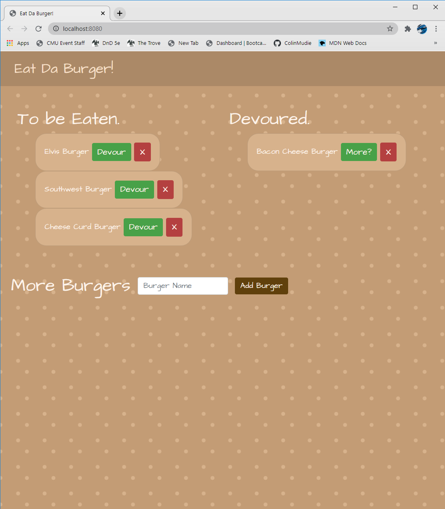

# Eat Da Burger

## Description
This app tracks burgers you want to eat and burgers you've devoured! The goal with this app was to combine a MySQL database with Express, Express-handlebars, and some ORM to Create, Read, Update, and Delete data from the MySQL db. The burger app follows the MVC design pattern.  
-  [Live Link](https://eat-da-cheese-curd-burger.herokuapp.com/)
-  [Github Link](https://github.com/ColinMudie/BurgerEater)

## Table of Contents

* [Usage](#usage)
* [Features](#features)
* [Questions](#questions)
* [Credits](#credits)
* [License](#license)

## Usage
- To Be Eaten
    -  Clicking "Devour" (after eating the burger of course), will Update the burgers eaten property to true in the MySQL database.
    - Clicking the red "X" will Delete the burger from the database.
- Devoured
    - Clicking "More?" will Update the burgers eaten property to false in the database.   
    - Clicking the red "X" will Delete the burger from the database. 
- More Burgers
    - Input form, clicking "Add Burger" will Create a new burger entry with the name as the value in the textbox.
    - a new burger will default to the "To be Eaten" section.  

## Features
- [node.js](https://nodejs.org/en/)
- [express.js](https://expressjs.com/)
- [express-handlebars](https://handlebarsjs.com/guide/)
- [mysql](https://www.npmjs.com/package/mysql)
- [HTML5](https://developer.mozilla.org/en-US/docs/Web/Guide/HTML/HTML5)
- [CSS](https://developer.mozilla.org/en-US/docs/Web/CSS)
- [Javascript](https://developer.mozilla.org/en-US/docs/Web/JavaScript)
- [Bootstrap](https://getbootstrap.com/)

## Questions
Github: [ColinMudie](https://github.com/ColinMudie/)  
Portfolio: [Colin's Portfolio](https://colinmudie.github.io/portfolio/index.html)   
Email: [csmudie1@gmail.com](csmudie1@gmail.com)

## License
MIT License
Copyright (c) [2021] [Colin Mudie]

Permission is hereby granted, free of charge, to any person obtaining a copy
of this software and associated documentation files (the "Software"), to deal
in the Software without restriction, including without limitation the rights
to use, copy, modify, merge, publish, distribute, sublicense, and/or sell
copies of the Software, and to permit persons to whom the Software is
furnished to do so, subject to the following conditions:

The above copyright notice and this permission notice shall be included in all
copies or substantial portions of the Software.

THE SOFTWARE IS PROVIDED "AS IS", WITHOUT WARRANTY OF ANY KIND, EXPRESS OR
IMPLIED, INCLUDING BUT NOT LIMITED TO THE WARRANTIES OF MERCHANTABILITY,
FITNESS FOR A PARTICULAR PURPOSE AND NONINFRINGEMENT. IN NO EVENT SHALL THE
AUTHORS OR COPYRIGHT HOLDERS BE LIABLE FOR ANY CLAIM, DAMAGES OR OTHER
LIABILITY, WHETHER IN AN ACTION OF CONTRACT, TORT OR OTHERWISE, ARISING FROM,
OUT OF OR IN CONNECTION WITH THE SOFTWARE OR THE USE OR OTHER DEALINGS IN THE
SOFTWARE.
